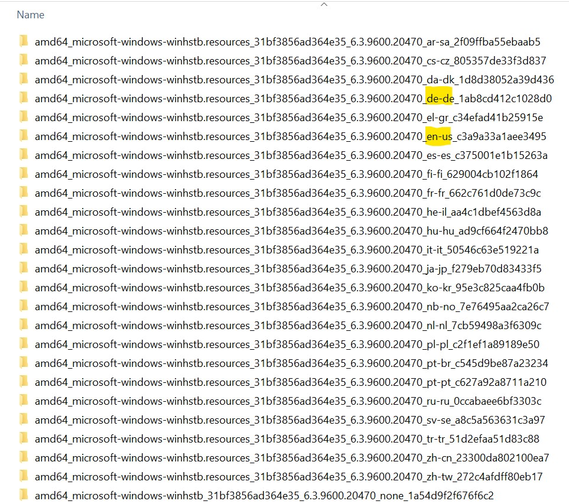

# WinHlp32 and Windows 10

_(Translated to English from the [German version](http://www.schmidhorst.de/regdom/WinHlp32Windows10.html). All research has been done by Horst Schmidt, therefore thank him, not me. I simply translated it.)_

Windows 10 includes only a stub _WinHlp32.exe_ file, the size of a few kilobytes, which redirects to a Microsoft webpage. It links to several WinHlp32 installer, the most up to date being the one for Windows 8.1. Trying to use any of the installers listed there leads to a message that the installer can't be used for Windows 10.

For that reason, if you want/must use WinHlp on Windows 10, a manual installation is required. Below is a guide how to do this for a Windows 10 64 bit system. If you need to do this for a 32 bit system, use the files in the _**x86**\_microsoft-windows..._ folders instead of the _**amd64**\_microsoft-windows..._ folders described below.

---

**Before we start, a word of warning, though:** *.hlp files can call _any_ API/exported method from _any_ DLL. Thus they're able to e.g. download files from the internet or send any data over the internet, circumventing any security measures web browsers have implemented. Microsoft also doesn't fix any security holes in WinHlp32 any longer. All of this means that following the below procedure poses a security risk to the system you apply to. _Please make sure you understand these risks before going on!_

---

- Log into your machine with an account that has administrative privilegues.

- Download the file [Windows8.1-KB917607-x64.msu](https://www.microsoft.com/de-de/download/details.aspx?id=47671) (KB917607) to a folder of your choice, e.g. ```WinHlp```. We use this and the following folder names as examples further on. If you name your folders differently, make sure to replace them in the below commands accordingly. _Since this keeps resetting with every bianual Windows update, it is a good idea to store it in a permanent location._

- Create a (temporary) subfolder in the folder you created above, e.g. ```expanded```.

- Open a command prompt and and navigate to the ```WinHlp``` folder. Expand the *.msu file with the command

  ```bat
  expand Windows8.1-KB917607-x64.msu -F:* expanded
  ```

  Here's what this command does: ```expand.exe``` is a builtin Windows tool, the paramater ```-F:*``` tells it to expand all files. The last parameter, ```expanded``` is the folder it should put the expanded files.

- At the command prompt, change to the ```expanded``` folder. Create another folder, e.g. ```cab```.

- Similar to what we've already done, we also need to expand all the files from Windows8.1-KB917607-x64.cab:

  ```bat
  expand Windows8.1-KB917607-x64.cab -F:* cab
  ```

- In order to be able to replace the stub WinHlp32.exe residing in the _Windows_ folder, we first need to [take over ownership of the file](https://docs.microsoft.com/en-us/previous-versions/windows/it-pro/windows-server-2008-R2-and-2008/cc753659(v=ws.11)?redirectedfrom=MSDN) and then also [grant access rights as Administrator](https://docs.microsoft.com/en-us/previous-versions/windows/it-pro/windows-server-2008-R2-and-2008/cc754344(v=ws.11)?redirectedfrom=MSDN):

  ```bat
  takeown /f "%WINDIR%\WinHlp32.exe" /a
  icacls "%WINDIR%\WinHlp32.exe" /grant *S-1-5-32-544:F
  ```

  ```*S-1-5-32-544``` is the [language independent SID user group _Administrators_](https://docs.microsoft.com/en-us/troubleshoot/windows-server/identity/security-identifiers-in-windows).

- Do the same for the language resources of _WinHlp32.exe_. That's the tricky part. i suggest doing this for your system's language and English. I'm on a German Windows 10, so that is:

  ```bat
  takeown /f "%WINDIR%\de-DE\WinHlp32.exe.mui" /a
  takeown /f "%WINDIR%\en-US\WinHlp32.exe.mui" /a
  takeown /f "%WINDIR%\System32\de-DE\ftsrch.dll.mui" /a
  icacls "%WINDIR%\de-DE\WinHlp32.exe.mui" /grant *S-1-5-32-544:F
  icacls "%WINDIR%\en-US\WinHlp32.exe.mui" /grant *S-1-5-32-544:F
  icacls "%WINDIR%\System32\de-DE\ftsrch.dll.mui" /grant *S-1-5-32-544:F
  ```

  You may receive an error message stating that a file doesn't exist. Don't worry - if it doesn't exist, this procedure is moot anyway.

- Search for _WinHlp32.exe_ in the folders within the folder ```cab```. You'll find two copies of it in the "none" _(see below)_ folders. For a 64 bit system the one in the _amd64\_microsoft-windows-..._ folder is the relevant one.  

  

  Copy this file to the _Windows_ directory.

- Copy the DLLs in the same folder as _WinHlp32.exe_ to the _Windows\System32_ directory.

- Finally we need to copy the language resource files _(*.mui)_ to their respective folders. These are located in the respective _amd64\_microsoft-windows-..._ language folder _(see below)_.  

  

  The relevant ones for my system are _de-de_ and _en-us_. Copy each _winhlp32.exe.mui_ to the respective folder in the _Windows_ directory, e.g. _winhlp32.exe.mui_ from the _amd64\_microsoft-windows-...de-de..._ folder goes to _Windows\de-DE_, _winhlp32.exe.mui_ from _amd64\_microsoft-windows-...en-us..._ to _Windows\en-US_.

- Do the same for the _ftsrch.dll.mui_ files, **but** make sure to copy those to the language folders in _Windows\\**System32**_, e.g. _Windows\System32\de-DE_.  

That's it! You now should be able to open these old _*.hlp_ files again.

---
Translated from this original [German version](http://www.schmidhorst.de/regdom/WinHlp32Windows10.html).
